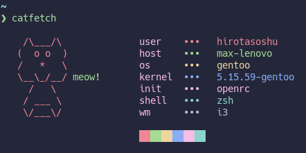

# catfetch



## 👇 Index

- [👇 Index](#-index)
- [⚙️ Installation](#️-installation)
- [🎨 Customization](#-customization)
  - [🖼️ Art](#️-art)

## ⚙️ Installation

1. Clone this repo with `git clone https://github.com/hirotasoshu/catfetch.git`
1. Run `cd catfetch`
1. Run `sudo make install` or `doas make install`
1. Now you can run it with `catfetch`

## 🎨 Customization

This fetch Is thought to be used as a personal fetch and have your own fork of it (That's why It doesn't work for all distros or have a lot of ASCII art)

### 🖼️ Art

```shell
ARTR1="${c1}   /\___/\            "
ARTR2="${c1}  (  o o  )           "
ARTR3="${c1}  /   *   \           "
ARTR4="${c1}  \__\_/__/${c2}meow! "
ARTR5="${c1}    /   \             "
ARTR6="${c1}   / ___ \            "
ARTR7="${c1}   \/___\/            "

```
